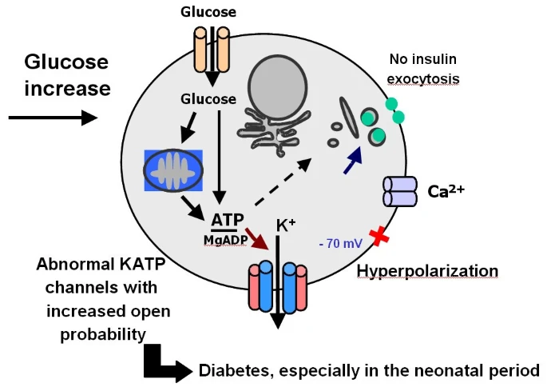

# PNDM Prediction

||
|:PNDM [^1]:| 

Permanent Neonatal Diabetes Mellitus (PNDM) is a type of diabetes that first appears within the first 6 months of life and persists throughout the lifespan. This form of diabetes is characterized by high blood sugar levels (hyperglycemia) resulting from a shortage of the hormone insulin. Insulin controls how much glucose (a type of sugar) is passed from the blood into cells for conversion to energy. Individuals with permanent neonatal diabetes mellitus experience slow growth before birth (intrauterine growth retardation). Affected infants have hyperglycemia and an excessive loss of fluids (dehydration) and are unable to gain weight and grow at the expected rate (failure to thrive) [^2].

In this study we tried to predict if a patient has a PNDM or not by using given clinical parameters using the sample [dataset](Data/). Below linear, non-linear and ensemble algorithms from `sklearn` have been evaluated by using $k$-fold cross validation method and the best performer has been chosen as predictor.

1. Logistic Regression (LR)
2. Linear Discriminant Analysis (LDA)
3. Decision Tree Classifier (DT)
4. $k$-Neighbors Classifier (KNN)
5. Support Vector Classifier (SVC)
6. Gaussian Naive Bayes (GNB)
7. Random Forest Classifier (RFC)
8. AdaBoost Classifier (ABC)
9. Gradient Boosting Classifier (GBC)

## References
[^1]: [Neonatal diabetes mellitus: a disease linked to multiple mechanisms](https://ojrd.biomedcentral.com/articles/10.1186/1750-1172-2-12)

[^2]: [Permanent neonatal diabetes mellitus](https://medlineplus.gov/genetics/condition/permanent-neonatal-diabetes-mellitus/#:~:text=Permanent%20neonatal%20diabetes%20mellitus%20is,shortage%20of%20the%20hormone%20insulin.)